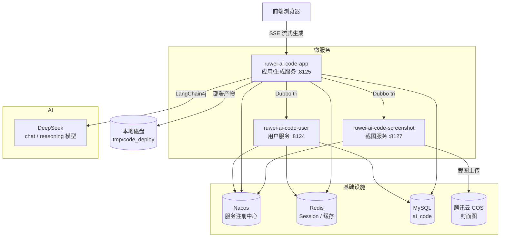

# ruwei-ai-code-microservice（AI 代码生成平台）

一个基于 **Spring Boot 3 + Dubbo 微服务架构** 的 AI 代码生成平台。用户输入一句话需求，AI 自动识别生成类型（原生 HTML / 多文件 / Vue 工程），通过 **SSE 流式** 输出代码、落盘保存、构建部署，并自动生成网页截图作为应用封面。

## 项目简介

| 项目 | 说明 |
| --- | --- |
| 定位 | AI 对话式代码生成 + 应用管理 + 一键部署平台 |
| 架构 | Maven 多模块 + Spring Boot 微服务 + Apache Dubbo 服务间调用 |
| 核心能力 | 智能路由生成类型、流式代码生成、Vue 工程构建、静态部署、网页截图封面、对话历史 |
| 数据库 | MySQL（库名 `ai_code`） |
| 服务注册 | Nacos（Dubbo Triple 协议） |

## 架构图



## 技术栈

| 分类 | 技术 |
| --- | --- |
| 语言/框架 | Java 21、Spring Boot 3.5.3、Spring Cloud 2023.0.1、Spring Cloud Alibaba 2023.0.1.0 |
| 微服务 | Apache Dubbo 3.3.0（tri 协议）、Nacos 注册中心 |
| ORM | MyBatis-Flex 1.11.0 |
| AI | LangChain4j 1.1.0-beta7（DeepSeek 模型接入、AiService、TokenStream、Tool） |
| 缓存/Session | Redis（Spring Session）+ Jedis、Caffeine 本地缓存 |
| 限流 | Redisson 3.50.0 分布式限流（注解 + AOP） |
| 流式输出 | Reactor（Flux / Mono）+ Server-Sent Events（SSE） |
| 对象存储 | 腾讯云 COS（截图封面上传） |
| 文档 | Knife4j 4.4.0（OpenAPI3） |
| 工具 | Hutool 5.8.38、Lombok 1.18.38 |
| 并发 | Java 虚拟线程（部署后异步截图） |

## 模块结构

| 模块 | 端口 | Dubbo 端口 | 职责 |
| --- | --- | --- | --- |
| `ruwei-ai-code-common` | - | - | 公共层：统一返回/异常体系、CORS、COS 客户端、常量、工具类、`@AuthCheck` 注解、MyBatis 代码生成器 |
| `ruwei-ai-code-model` | - | - | 实体层：`User` / `App` / `ChatHistory` 实体、DTO、VO、枚举（角色、代码生成类型、消息类型） |
| `ruwei-ai-code-client` | - | - | Dubbo 内部服务接口：`InnerUserService`、`InnerScreenshotService` |
| `ruwei-ai-code-user` | 8124 | 50051 | 用户服务：注册 / 登录 / 注销 / 当前用户 / 用户管理 |
| `ruwei-ai-code-app` | 8125 | 50053 | 主应用：应用 CRUD、AI 流式生成、代码解析落盘、Vue 构建、部署、对话历史、下载代码、限流 |
| `ruwei-ai-code-ai` | - | - | AI 生成核心：LangChain4j AiService 接口、模型配置（推理/路由/流式）、文件工具（Tool）、安全 Guardrail、流式消息模型 |
| `ruwei-ai-code-screenshot` | 8127 | 50052 | 截图服务：网页截图生成并上传 COS |

## 核心流程

### 1. 创建应用（AI 智能路由）

```
用户输入需求 → POST /api/app/add
  → AI 路由模型判断生成类型（html / multi_file / vue_project）
  → 应用名取需求前 12 字 → 入库
```

### 2. 流式生成代码（SSE）

```
GET /api/app/chat/gen/code?appId=&message= （SSE，用户维度限流 5 次/分钟）
  → 保存用户消息到对话历史
  → 按生成类型分发：
       HTML / 多文件 → Flux 流式拼接 → 完成后解析 → 落盘 tmp/code_output
       Vue 工程     → TokenStream + 文件工具（读写/修改/删除）→ 完成后 npm 构建
  → 流式回传 AI 增量内容 / 工具调用事件 → SSE 推送给前端
```

### 3. 部署与封面

```
POST /api/app/deploy
  → Vue 项目先构建出 dist
  → 复制产物到 tmp/code_deploy/{deployKey}（无则生成 6 位随机 key）
  → 返回访问 URL（http://localhost/{deployKey}/）
  → 虚拟线程异步调用截图服务生成封面 → 上传 COS → 回写 app.cover
```

### 4. 对话历史

用户消息与 AI 回复（原始/解析后的文件格式）均持久化，支持按应用游标分页查询，删除应用时级联删除。

## 快速开始

### 环境要求

- JDK 21+
- Maven 3.8+
- MySQL 8.x（创建库 `ai_code`）
- Redis 6.x
- Nacos 2.x（`127.0.0.1:8848`，账号 `nacos/nacos`）
- Node.js（Vue 工程构建需要）

### 1. 初始化数据库

```sql
CREATE DATABASE IF NOT EXISTS ai_code DEFAULT CHARACTER SET utf8mb4;
-- 建表脚本参考 ruwei-ai-code-common 中的 MyBatisCodeGenerator，或按实体类（User/App/ChatHistory）手动建表
```

### 2. 配置

按需修改各服务 `src/main/resources/application*.yml`：

| 配置项 | 位置 | 说明 |
| --- | --- | --- |
| `spring.datasource.*` | user / app | MySQL 连接（默认 root/123456@localhost:3306/ai_code） |
| `spring.data.redis.*` | user / app | Redis 连接 |
| `dubbo.registry.address` | 所有服务 | Nacos 注册中心地址 |
| `langchain4j.open-ai.*` | app（local 配置） | DeepSeek API base-url / api-key / model-name |
| `cos.client.*` | app | 腾讯云 COS（封面图上传） |
| `pexels.api-key` | app | Pexels 图片素材 |
| `dashscope.*` | app | 阿里云百炼图片生成（wan2.2-t2i-flash） |
| `AppConstant` | common | 生成/部署目录、部署域名（默认 `http://localhost`） |

> ⚠️ `application-local.yml` 中包含真实密钥，**切勿提交到公开仓库**。

### 3. 启动服务（按依赖顺序）

```bash
# 1. 基础设施：MySQL / Redis / Nacos 先就绪

# 2. 用户服务（8124）
mvn -pl ruwei-ai-code-user spring-boot:run

# 3. 截图服务（8127）
mvn -pl ruwei-ai-code-screenshot spring-boot:run

# 4. 主应用（8125）
mvn -pl ruwei-ai-code-app spring-boot:run
```

访问接口文档：`http://localhost:8125/api/doc.html`（Knife4j）

## API 一览（主应用 `/api` 前缀）

| 方法 | 路径 | 说明 | 权限 |
| --- | --- | --- | --- |
| GET | `/app/chat/gen/code` | AI 流式生成代码（SSE） | 登录（限流） |
| POST | `/app/add` | 创建应用（AI 路由类型） | 登录 |
| POST | `/app/update` / `/app/delete` | 更新/删除本人应用 | 本人 |
| GET | `/app/get/vo` | 应用详情 | 登录 |
| POST | `/app/my/list/page/vo` | 我的应用分页 | 登录 |
| POST | `/app/good/list/page/vo` | 精选应用分页（Redis 缓存） | 公开 |
| POST | `/app/deploy` | 部署应用，返回 URL | 本人 |
| GET | `/app/download/{appId}` | 下载应用代码（zip） | 本人 |
| POST | `/app/admin/*` | 管理员管理接口 | ADMIN |
| GET | `/chatHistory/app/{appId}` | 对话历史（游标分页） | 本人 |
| POST | `/chatHistory/admin/list/page/vo` | 全部对话历史 | ADMIN |

用户服务 `/api/user`：`/register`、`/login`、`/get/login`、`/logout`、`/update/my`、`/list/page/vo` 等。

## 关键设计点

- **统一返回与异常**：`BaseResponse<T>` + `ResultUtils` 成功包装，`BusinessException` + `GlobalExceptionHandler` 统一错误处理，`ThrowUtils.throwIf` 前置校验。
- **权限注解**：`@AuthCheck(mustRole = ...)` AOP 校验管理员/普通用户权限。
- **分布式限流**：`@RateLimit` 注解 + Redisson 实现用户/IP 维度限流（SSE 接口 5 次/分钟）。
- **会话共享**：Spring Session + Redis 存储，跨服务（user ↔ app）共享登录态，Cookie 30 天。
- **AI 多例工厂**：`AICodeGeneratorServiceFactory` / `AiCodeGenTypeRoutingServiceFactory` 按 appId 创建独立 AI 会话实例（prototype 作用域），配合 `@MemoryId(appId)` 在 Redis 中按应用隔离对话记忆。
- **Vue 工程生成**：通过 LangChain4j Tool（文件读写/修改/删除）让模型直接操作项目文件，生成完成后同步执行 `npm run build`。
- **N+1 优化**：应用列表批量查询用户信息，避免逐条查库。
- **删除级联**：删除应用时级联删除对话历史（失败仅告警不阻断）。

## 目录结构速览

```
ruwei-ai-code-microservice/
├── pom.xml                              # 父 POM（依赖管理 + 插件）
├── ruwei-ai-code-common/                # 公共层
│   └── src/main/java/com/ruwei/
│       ├── common/                      # BaseResponse / ResultUtils / PageRequest
│       ├── exception/                   # 异常体系
│       ├── config/                      # CORS / COS / Json
│       ├── constant/                    # AppConstant / UserConstant
│       ├── annotation/                  # @AuthCheck
│       └── utils / manager / generator
├── ruwei-ai-code-model/                 # 实体 / DTO / VO / 枚举
├── ruwei-ai-code-client/                # Dubbo 内部服务接口
├── ruwei-ai-code-user/                  # 用户服务（8124）
├── ruwei-ai-code-app/                   # 主应用（8125）
│   └── src/main/java/com/ruwei/ruweicodeapp/
│       ├── controller/                  # App / ChatHistory / 静态资源
│       ├── core/                        # AI 门面 / 解析器 / 保存器 / Vue 构建
│       ├── ratelimter/                  # 限流注解 + AOP + Redisson 配置
│       └── service/                     # 应用 / 对话历史 / 项目下载
├── ruwei-ai-code-ai/                    # AI 生成核心
│   └── src/main/java/com/ruwei/ai/
│       ├── config/                      # 推理 / 路由 / 流式模型配置
│       ├── tools/                       # 文件工具（读写/修改/删除/退出）
│       ├── guardrail/                   # Prompt 安全 / 重试
│       └── model/                       # 流式消息模型
└── ruwei-ai-code-screenshot/            # 截图服务（8127）
```

## 注意事项

- **沙箱/本地验证**：构建需本地 `mvn` 执行，CI 环境需预装 Node.js 才能构建 Vue 应用。
- **部署目录**：默认输出到服务进程工作目录下的 `tmp/code_output`、`tmp/code_deploy`，生产环境建议改为绝对路径并通过 Nginx 托管。
- **密钥安全**：`application-local.yml` 内含 DeepSeek / COS / Pexels / DashScope 密钥，建议迁移到环境变量或配置中心（Nacos/Consul）。
- **单机 Session 共享**：当前依赖 Redis 实现跨服务登录态共享，生产多副本部署时需保证同一 Redis 实例。
